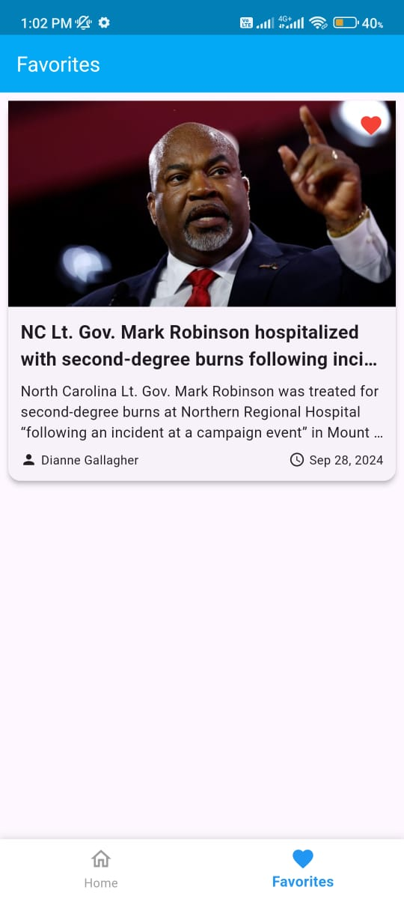

# Flutter News App 📰

A simple Flutter application that fetches and displays the latest news headlines using the [NewsAPI](https://newsapi.org). Users can browse top headlines, view article details, and manage their favorite articles.

## Features 🤹‍♀️

- Home: Top Headlines
- Detail: WebView
- Favorite: List Favorite

## Demo 🪟

  

---
